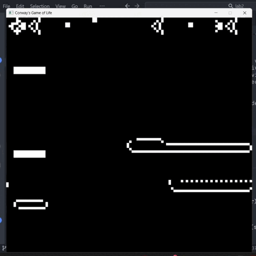

# Conway's Game of Life

Este proyecto implementa el Juego de la Vida de Conway utilizando Rust y la biblioteca `minifb` para renderizar en tiempo real.

## Cómo ejecutar el proyecto

1. Clona este repositorio:

   ```sh
   git clone https://github.com/Diegoval-Dev/gpc-lab2
   cd gcp-lab2
   ```
2. Compila el proyecto:

   ```sh
   cargo build
   ```
3. Ejecuta el proyecto:

   ```sh
   cargo run
   ```
## Descripción
El Juego de la Vida de Conway es un autómata celular desarrollado por el matemático John Conway. Es un juego de cero jugadores, lo que significa que su evolución está determinada por su estado inicial, sin necesidad de entrada adicional.

## Reglas
1. Cualquier célula viva con menos de dos vecinos vivos muere (subpoblación).
2. Cualquier célula viva con dos o tres vecinos vivos sobrevive.
3. Cualquier célula viva con más de tres vecinos vivos muere (sobrepoblación).
4. Cualquier célula muerta con exactamente tres vecinos vivos se convierte en una célula viva (reproducción).

## Patrones Iniciales
Se ha definido un patrón inicial simple, pero puedes modificar el código para probar diferentes patrones.

Capturas de Pantalla
